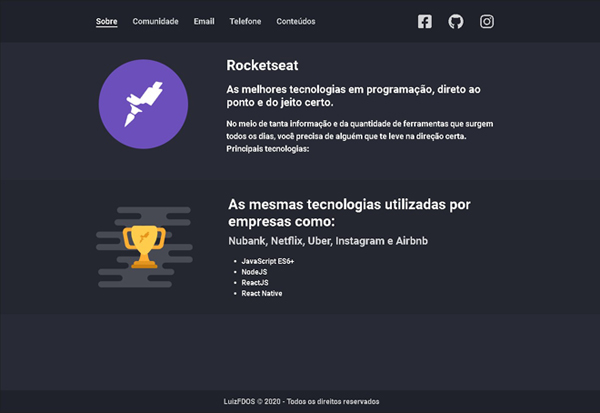

<h1 align="center">
    
</h1>
<h3 align="center">
  Desafios Módulo 2 - Introdução a Programação WEB
</h3>
<p align="center">
  <a href="https://luizfdos.github.io/">
    
  </a>
  <a href="LICENSE" >
    
  </a>
  </p>


## :rocket: Desafios

  Resolução de desafios propostos para fortalecer conceitos mostrados em aula. 

### 2-1 Primeiro HTML

- [x] Criar um arquivo html que contenha um favicon e um header com 3 links: Comunidade, Email e Telefone.


### 2-2 Página de descrição

- [x] A partir do arquivo do desafio 2-1, adicionar um novo link no header chamado Sobre. Essa página deverá mostrar informações referentes a Rocketseat.

### 2-3 Paginas de cursos e iframe

- [x] Adicionar no header um link chamado Conteúdos. Essa página deve conter um grid onde devem ser mostrados os 3 principais cursos da Rocketseat: Starter, Launchbase e GoStack. Ao clicar em um dos cursos, deve ser aberta uma modal onde um iframe irá carregar as informações do curso selecionado.
### 2-4 Construindo Foodfy
- [x] construir um site completo para uma empresa de receitas chamada Foodfy. Para ver o resultado [clique aqui](https://github.com/luizfdos/foodfy)
## :construction_worker: Como usar 
- Faça uma cópia deste respositório
```
 $ git clone https://github.com/luizfdos/launchbase_desafios02.git
```
  - Abra o arquivo index.html

## :computer: Resultado

<p align="center"></p>
<p align="center"></p>
<p align="center"></p>

## :closed_book: License

Esse projeto está sob a licença MIT. Veja o arquivo [LICENSE](/LICENSE) para mais detalhes.


Feito com :purple_heart: por [Luiz Fernando](https://luizfdos.github.io) 🚀

